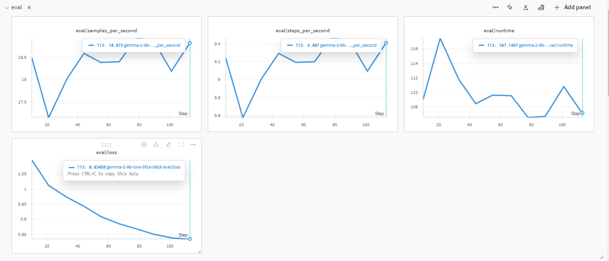

# Gemma-2-ko-9B Law QA Instruct Tuning

### Dataset
- Aihub 법률/규정 텍스트 분석 데이터 QA셋 (20,160개) [AIhub 데이터셋](https://www.aihub.or.kr/aihubdata/data/view.do?currMenu=115&topMenu=100&dataSetSn=71723)
 

### BaseModel
- Huggingface **rtzr/ko-gemma-2-9b-it** [rtzr/ko-gemma-2-9b-it](https://huggingface.co/rtzr/ko-gemma-2-9b-it)
 

### Evaluation 결과

### Test 결과
